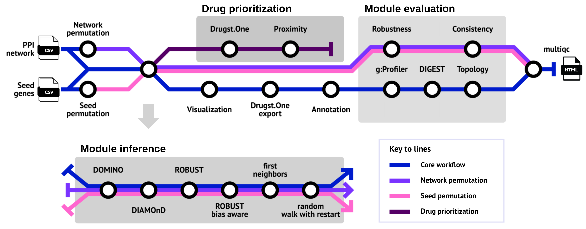

# REPO4EU/modulediscovery

[](https://github.com/REPO4EU/modulediscovery/actions/workflows/ci.yml)
[](https://github.com/REPO4EU/modulediscovery/actions/workflows/linting.yml)[](https://doi.org/10.5281/zenodo.XXXXXXX)
[](https://www.nf-test.com)

[](https://www.nextflow.io/)
[](https://docs.conda.io/en/latest/)
[](https://www.docker.com/)
[](https://sylabs.io/docs/)
[](https://cloud.seqera.io/launch?pipeline=https://github.com/REPO4EU/modulediscovery)

## Introduction

**REPO4EU/modulediscovery** is a bioinformatics pipeline for network medicine hypothesis generation, designed for identifying active/disease modules. Developed and maintained by the [RePo4EU](https://repo4.eu/) consortium, it aims to characterize the molecular mechanisms of diseases by analyzing the local neighborhood of disease-associated genes or proteins (seeds) within the interactome. This approach can help identify potential drug targets for drug repurposing.



- Module inference (all enabled by default):
  - [`DOMINO`](https://github.com/Shamir-Lab/DOMINO)
  - [`DIAMOnD`](https://github.com/dinaghiassian/DIAMOnD)
  - [`ROBUST`](https://github.com/bionetslab/robust)
  - [`ROBUST bias aware`](https://github.com/bionetslab/robust_bias_aware)
  - `first neighbors`
  - `random walk with restart`
- Visualization of the module networks ([`graph-tool`](https://graph-tool.skewed.de/), [`pyvis`](https://github.com/WestHealth/pyvis))
- Export to the network medicine web visualization tool [`Drugst.One`](https://drugst.one/)
- Annotation with biological data (targeting drugs, side effects, associated disorders, cellular localization) queried from [`NeDRexDB`](https://nedrex.net/) and conversion to [`BioPAX`](https://www.biopax.org/) format.
- Evaluation
  - Over-representation analysis ([`g:Profiler`](https://cran.r-project.org/web/packages/gprofiler2/index.html))
  - Functional coherence analysis ([`DIGEST`](https://pypi.org/project/biodigest/))
  - Network topology analysis ([`graph-tool`](https://graph-tool.skewed.de/))
  - Seed set permutation-based evaluation (enabled by `--run_seed_permutation`)
  - Network permutation-based evaluation (enabled by `--run_network_permutation`)
- Drug prioritization using the API of [`Drugst.One`](https://drugst.one/)
- Result and evaluation summary ([`MultiQC`](https://seqera.io/multiqc/))

## Usage

> [!NOTE]
> If you are new to Nextflow and nf-core, please refer to [this page](https://nf-co.re/docs/usage/installation) on how to set-up Nextflow. Make sure to [test your setup](https://nf-co.re/docs/usage/introduction#how-to-run-a-pipeline) with `-profile test` before running the workflow on actual data.

### Setup

Clone the repository:

```bash
git clone https://github.com/REPO4EU/modulediscovery.git
cd modulediscovery
```

Install required software e.g. via conda (docker not included):

```bash
conda env create -n modulediscovery -f environment.yaml
conda activate modulediscovery
```

The pipeline should be run from outside of the code repository since nextflow, by default, will write into the execution directory.

Run with included test data:

```bash
nextflow run <PATH_TO_REPO>/modulediscovery/main.nf \
   -profile <docker/singularity>,test \
   --outdir <OUTDIR>
```

### Running the pipeline

Now, you can run the pipeline using:

```bash
nextflow run <PATH_TO_REPO>/modulediscovery/main.nf \
   -profile <docker/singularity> \
   --seeds <SEED_FILE> \
   --network <NETWORK_FILE> \
   --outdir <OUTDIR>
```

This will run the pipeline based on the provided `<SEED_FILE>` and `<NETWORK_FILE>`. Results will be saved to the specified `<OUTDIR>`. Use `-profile` to set whether docker or singularity should be used for software deployment.

> [!WARNING]
> Please provide pipeline parameters via the CLI or Nextflow `-params-file` option. Custom config files including those provided by the `-c` Nextflow option can be used to provide any configuration _**except for parameters**_; see [docs](https://nf-co.re/docs/usage/getting_started/configuration#custom-configuration-files).

For more details and further functionality, please refer to the [usage documentation](docs/usage.md) and run the pipeline with the `--help` flag.

## Credits

REPO4EU/modulediscovery was originally written by the [RePo4EU](https://repo4.eu/) consortium.

We thank the following people for their extensive assistance in the development of this pipeline:

- [Johannes Kersting](https://github.com/JohannesKersting) (TUM)
- [Lisa Spindler](https://github.com/lspindler2509) (TUM)
- [Quirin Manz](https://github.com/quirinmanz) (TUM)
- [Quim Aguirre](https://github.com/quimaguirre) (STALICLA)
- [Chloé Bucheron](https://github.com/ChloeBubu) (University Vienna)

## Contributions and Support

If you would like to contribute to this pipeline, please see the [contributing guidelines](.github/CONTRIBUTING.md).

If you want to include an additional module identification approach, please see [this guide](docs/contributing.md).

## Citations

<!-- TODO nf-core: Add citation for pipeline after first release. Uncomment lines below and update Zenodo doi and badge at the top of this file. -->
<!-- If you use REPO4EU/modulediscovery for your analysis, please cite it using the following doi: [10.5281/zenodo.XXXXXX](https://doi.org/10.5281/zenodo.XXXXXX) -->

<!-- TODO nf-core: Add bibliography of tools and data used in your pipeline -->

An extensive list of references for the tools used by the pipeline can be found in the [`CITATIONS.md`](CITATIONS.md) file.

This pipeline uses code and infrastructure developed and maintained by the [nf-core](https://nf-co.re) community, reused here under the [MIT license](https://github.com/nf-core/tools/blob/main/LICENSE).

> **The nf-core framework for community-curated bioinformatics pipelines.**
>
> Philip Ewels, Alexander Peltzer, Sven Fillinger, Harshil Patel, Johannes Alneberg, Andreas Wilm, Maxime Ulysse Garcia, Paolo Di Tommaso & Sven Nahnsen.
>
> _Nat Biotechnol._ 2020 Feb 13. doi: [10.1038/s41587-020-0439-x](https://dx.doi.org/10.1038/s41587-020-0439-x).
